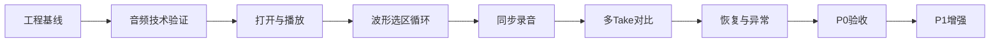

# Shadowing MVP 开发计划

## 范围与交付线

- **MVP 完成线**：完成 PRD §17 的全部 P0，并跑通 §18 的 24 步验收流程。
- **MVP 增强线**：P0 稳定后再实现 P1，包括 A/B、Together、Keep、Recordings、Settings、快捷键和可配置倒计时。
- **明确排除**：P2、网络、AI、账号、Rust/UniFFI；不为这些能力预建入口或抽象。
- 已提交的工程基线为 `d6d146d`；后续所有阶段都保持 [`Makefile`](Makefile) 的 `make check` 通过。

## M1：稳定领域与平台边界

- 在 [`Shadowing/Domain`](Shadowing/Domain) 增加显式练习、录音和对比状态机，覆盖合法转换与非法 intent；避免以多个 boolean 推导关键状态。
- 补齐面向 ViewModel 的窄协议和测试替身；Domain 只使用 `TimeInterval`、领域事件和值对象，不泄漏 `AVAudioFramePosition`、GRDB 或其他平台类型。
- 基于现有 [`PersistenceContracts.swift`](Shadowing/Domain/PersistenceContracts.swift) 实现 GRDB project/take/settings repository、录音文件 store 和 security-scoped bookmark service。
- 建立 repository contract tests、临时文件事务测试和内存测试替身；现有 [`AppDatabase.swift`](Shadowing/Persistence/AppDatabase.swift) 的 v1 migration 不再改写。
- 出口：状态机和 repository contract 测试通过；文件与数据库失败不会产生悬空 Take。

## M2：先解除音频核心风险

- 在 [`Shadowing/Audio`](Shadowing/Audio) 实现可复用的 `PracticeAudioEngine`、内部渲染时钟、选区调度器和事件流；ViewModel 只接收领域时间与事件。
- 完成 ADR-0004 Spike：5/30/60 秒选区各循环 20 次，记录 expected/actual frame，自动停止误差不超过一个 render buffer；验证 interruption 和 route change 可观测。
- 完成 ADR-0005 Spike：使用 AVAssetReader + Accelerate/vDSP 生成多分辨率峰值，以文件指纹缓存；用至少 60 分钟 MP3 记录首次生成耗时、峰值内存和窗口缩放表现。
- 验证同步录音最小链路：原音调度、input tap、临时文件、提前停止、麦克风断开和磁盘写入失败；实时 callback 不做 SQLite、阻塞等待或无界分配。
- 将测量结果写入对应 ADR；只有指标通过后才把 ADR-0004/0005 从 Proposed 改为 Accepted。失败时先更新 ADR，不围绕失败方案继续铺 UI。

## M3：打开 MP3、基础播放与波形

- 在 [`Shadowing/Services`](Shadowing/Services) 实现文件选择、拖拽校验、bookmark 生命周期、MP3 元数据加载和用户可恢复错误映射。
- 在 [`Shadowing/Features/Files`](Shadowing/Features/Files) 实现空状态、Choose File、拖拽、加载状态和打开失败处理。
- 在 [`Shadowing/Features/Practice`](Shadowing/Features/Practice) 实现练习页、Canvas 波形、播放游标、播放/暂停、点击跳转、前后 5 秒、音量和速度。
- 在 [`Shadowing/App`](Shadowing/App) 建立 `AppDependencies` 组合根，注入 engine、repositories、bookmark 和 waveform services；Views 不直接访问平台实现。
- 自动化：文件 loader、bookmark round-trip、波形降采样、取消/失败、Files/Practice ViewModel 测试。
- 出口：PRD §7.7 与 §8.3 的验收项通过；损坏、缺失、无权限文件都有恢复动作。

## M4：选区与循环练习

- 扩展现有 [`Models.swift`](Shadowing/Domain/Models.swift) 的选区纯规则，覆盖创建、拖动边界、clamp 和 0.5–60 秒限制。
- 实现波形拖选、左右把手和高亮层；创建选区后 playhead 回到起点并自动开启循环。
- 将速度变化、seek、暂停和关闭循环统一交给音频调度器，UI timer 只显示进度。
- 自动化：选区边界、ViewModel intent、无选区时循环禁用、变速后重新调度测试。
- 出口：PRD §8.9 和 §18 第 4–9 步通过。

## M5：同步录音、双轨波形与 Take 提交

- 实现麦克风权限服务、默认 3 秒倒计时、录音状态机、耳机轻提示和 Open System Settings 恢复入口。
- 使用 M2 验证过的音频图同步播放原音并录制麦克风；以 render time 自动停止，支持用户提前停止。
- 实时峰值通过有界环形缓冲投影到双轨 UI；录音期间锁定选区、seek、文件切换和速度。
- 严格执行“临时录音 → 可播放校验 → 原子移动 → 数据库事务”；过短或失败录音不创建 Take。
- 自动化：权限状态、倒计时 fake clock、stop reason、过短拒绝、提交/回滚测试。
- 出口：PRD §9.9 和 §18 第 10–14 步通过；真实麦克风、耳机、设备断开场景完成手工验证。

## M6：Original/My Take、多 Take 与重录

- 在 [`Shadowing/Features/Compare`](Shadowing/Features/Compare) 实现 Original、My Take、双轨对齐、Take 列表、选中状态、重录和删除确认。
- Take 保存创建时的 `PracticeRegion` 快照；修改当前选区不改变旧 Take，并显示基于旧选区的提示。
- 序号由持久化层事务安全生成；Re-record 永不覆盖旧文件；删除当前 Take 后选择最近剩余项，没有剩余项则回到未录音状态。
- 自动化：sequence、选择回退、region snapshot、删除文件/记录一致性和 Compare ViewModel 测试。
- 出口：PRD §10 的 P0 子集与 §18 第 15–20 步通过。

## M7：持久化恢复与异常完整性

- 在应用启动、切换文件和关闭前保存项目、playhead、选区、速度、selected Take 和文件引用；使用防抖保存高频 playhead，关键状态立即保存。
- 实现最近项目恢复所需的数据路径，但完整最近文件列表 UI 留到 P1。
- 实现 bookmark stale、源 MP3 移动/删除后的重新定位；重定位成功后保留项目、选区和 Takes。
- 覆盖录音中关窗、播放中打开新文件、麦克风断开、磁盘满、临时文件残留和源文件缺失。
- 自动化：重启 hydrate、repository 排序/cascade、孤立文件恢复、ViewModel 异常流程测试。
- 出口：PRD §13、§15 和 §18 第 21–24 步通过；异常不 silent fail、不丢有效 Take。

## M8：P0 发布候选验收

- 在短、中、长 MP3 上完整执行 PRD §18；额外覆盖 0.5 秒和 60 秒选区、连续多次重录、应用强制退出后的恢复。
- 检查窗口缩放、VoiceOver 标签、键盘焦点、颜色语义和录音状态反馈；不加入 P2 文本、缩放或延迟校准。
- 运行 `make check`，确认 CI、migration、repository contracts 和状态机测试全部通过。
- 记录音频硬件矩阵、已知限制和验收证据；达到出口后形成首个 P0 release candidate。

## M9：P1 增强包

- A/B：原音 → 明确短暂停顿 → 当前 Take；调度逻辑使用可测试 scheduler。
- Together：共同起点双轨播放，复用 M2 同步测量；不在本阶段引入 P2 延迟校准。
- Keep This Take：一个练习区间最多一个 kept Take，不删除其他 Take。
- 完成最近文件、Recordings 和 Settings 页面；设置涵盖输入设备、电平、倒计时、录音时播放原音、默认速度和存储位置。
- 增加 PRD §14 快捷键并处理文本输入焦点冲突。
- 每个功能独立作为可回滚垂直切片；P1 不与 P0 release candidate 混成一个大提交。

## 每阶段统一 Definition of Done

- 对应 PRD 验收项与失败状态均有实现。
- 分层、Swift 6 actor isolation 和 ADR 边界未被破坏。
- 确定性逻辑有单元/contract/migration 测试；硬件行为有手工清单。
- 没有 warning、禁用检查、生成工程、录音、数据库或 secret 进入 Git。
- `make check` 通过；长期决策变化已由新 ADR 记录。