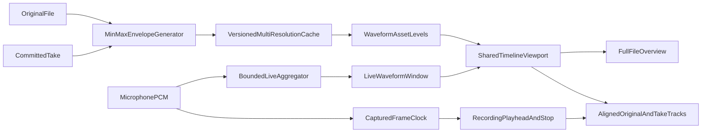

# 双轨波形时间轴方案

## 分析结论

这不是只改 Canvas 样式：当前原音在进入 UI 前只保留最粗的一层并压到 4096 点，Take 实时预览每 4096 帧只有一个点，双轨又按各自数组长度拉伸，所以既稀疏也不是真正按时间对齐。静音录音还使用 `Date` 计时停止，不适合作为对齐基准。

采用用户选择的 A+B 组合：保留完整文件总览，同时提供可在全文件范围缩放、平移的主时间轴；进入录音/对比时默认缩放到选区，但仍使用同一个时间轴模型。

## 目标体验

- 波形改为接近音频编辑器的连续 min/max 包络，不再显示间隔明显的圆角竖条。
- 顶部总览始终显示完整文件、选区和当前可见窗口；主时间轴支持 pinch/缩放控件、水平平移、重置及“缩放到选区”。
- 录音时上轨显示静音的 Original 选区，下轨实时生长 My Take；两轨共享刻度、游标和视口。
- `Original(region.start + t)` 与 `Take(t)` 映射到相同 x 坐标。提前停止时 Take 后方留空，不再把短录音拉满整条轨道。
- 最大缩放受最细缓存分辨率约束，不伪造“无限精度”；首版以约 256 frames/point 为上限。
- 两轨可分别做稳健的显示增益（例如 99% 分位映射到轨高），便于观察语音形状；这不代表两轨绝对响度可直接比较。

## 数据与时间架构

- 在 [AudioImportContracts.swift](Shadowing/Domain/AudioImportContracts.swift) 将单一 `[Float]` 展示契约升级为领域中立的多层 `WaveformAsset`：每个点保存 `minimum/maximum`、`framesPerPoint`、采样率和时长。
- 在 [WaveformPeakGenerator.swift](Shadowing/Audio/WaveformPeakGenerator.swift) 生成 `[256, 1024, 4096, 16384]` 多分辨率 min/max 包络；在 [WaveformCache.swift](Shadowing/Audio/WaveformCache.swift) 增加可重建的缓存版本，旧缓存自动失效重建。
- 让 Original 和 Take 共用缓存/生成服务，替换 [TakeWaveformPeaks.swift](Shadowing/Audio/TakeWaveformPeaks.swift) 的单分辨率、每次重解码路径。
- 新增纯值 `TimelineViewport`、时间到像素映射和 LOD 选择器；根据可见时间范围、采样率与视图宽度，只提交约 1–2 个 envelope point/pixel 给 Canvas。
- `Take t=0` 默认锚定 `region.start`。本阶段不增加数据库 offset 字段，也不做设备延迟校准或手动位移；这些仍作为后续硬件校准能力。

## 实现步骤

1. **先修正事实来源与契约**
   - 更新仍为 Proposed 的 [ADR-0005](docs/adr/0005-waveform-processing.md)，明确 min/max envelope、viewport LOD、Take 缓存和 60 分钟性能标准。
   - 将 PRD 中“波形缩放”为 P2 的描述调整到当前交付范围，并补充双轨静音录音对齐验收。

2. **建立多分辨率包络数据层**
   - 重构 [WaveformPeakGenerator.swift](Shadowing/Audio/WaveformPeakGenerator.swift)、[CachedWaveformService.swift](Shadowing/Audio/CachedWaveformService.swift) 与 [WaveformCache.swift](Shadowing/Audio/WaveformCache.swift)。
   - 新增按 `visibleRange + pixelWidth` 选择 level、切片并聚合 min/max 的确定性算法。
   - Original 与已提交 Take 统一走版本化文件缓存；不把波形写入 SQLite。

3. **将静音录音改为采样帧时钟**
   - 在 [RecordingPipeline.swift](Shadowing/Audio/RecordingPipeline.swift) 累计捕获帧并在后台聚合细粒度实时 envelope，实时 callback 只做有界复制/入队。
   - 在 [PracticeAudioEngine+Recording.swift](Shadowing/Audio/PracticeAudioEngine+Recording.swift) 用 captured frames 发布进度并触发选区终点，不再使用 `Date + 33ms sleep` 决定边界；误差目标不超过一个输入 buffer。
   - 实时数据携带相对录音时间，ViewModel 不再依赖 append 顺序或 `fillFraction` 拉伸。

4. **统一波形时间轴与交互**
   - 用新的 `WaveformTimelineView`/renderer 替换 [WaveformView.swift](Shadowing/Features/Practice/WaveformView.swift) 和 [AlignedRecordingTracksView.swift](Shadowing/Features/Practice/AlignedRecordingTracksView.swift) 中重复的柱状绘制。
   - 在 [PracticeViewModel.swift](Shadowing/Features/Practice/PracticeViewModel.swift) 持有 session-only viewport；默认完整文件，选区创建/录音/对比时可 fit selection。
   - 总览与主时间轴共享选区、播放头和 visible range；双轨必须共享同一个时间到 x 的转换。
   - 手势规则：单击 seek、拖动创建/调整选区、pinch 或缩放控件以指针时间为锚缩放、双指水平滚动平移；录音期间锁定 zoom/pan/seek。提供“全局”“选区”按钮和键盘/VoiceOver 替代操作。

5. **接入录音与对比工作流**
   - 在 [RecordingWorkflow.swift](Shadowing/Features/Practice/RecordingWorkflow.swift) 将实时 envelope 按 `region.start + recordedTime` 放入共享时间轴。
   - 在 [ComparisonWorkflow.swift](Shadowing/Features/Practice/ComparisonWorkflow.swift) 和 [CompareWorkspaceView.swift](Shadowing/Features/Compare/CompareWorkspaceView.swift) 统一 Original、My Take、A/B、Together 的游标映射；切换 Take 时加载对应多层缓存。
   - 提前停止的 Take 按实际 duration 截止，区域剩余部分显示为空白。

## 验证标准

- 单元测试覆盖 viewport zoom 锚点、pan 边界、LOD 选择、时间到像素映射、min/max 聚合，以及 `Take(0) == Original(region.start)`。
- 录音管线测试覆盖捕获帧进度、终点误差不超过一个 buffer、实时 envelope 有界和 Float/Int16/Int32 输入。
- 5/30/60 秒选区分别验证录音中实时增长、提前停止空白尾部、恢复后 Take 对齐、A/B/Together 游标一致。
- 60 分钟 MP3 验证首次生成、缓存命中、连续缩放/平移、窗口 resize 的内存和帧率；ADR-0005 在硬件/性能 Spike 完成前保持 Proposed。
- 最终运行 `make check`，并按 [p0-acceptance-checklist.md](docs/testing/p0-acceptance-checklist.md) 增补手工验收。
