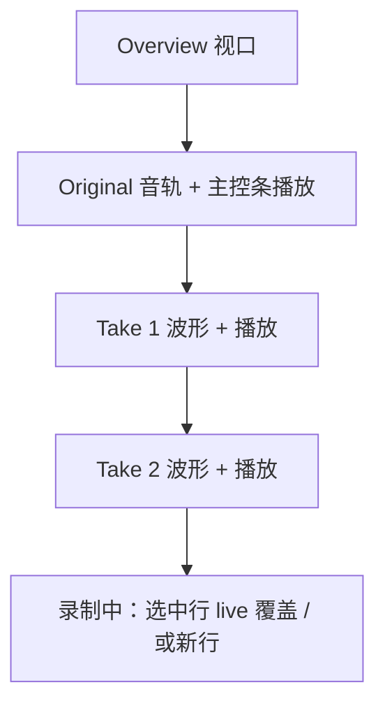

# 多轨稳定练习页重构

## 产品决策（相对现行 PRD §10）

本次按你的交互要求改产品行为，并同步更新 [`docs/prd/prd-v0.0.1-2026-07-11.md`](docs/prd/prd-v0.0.1-2026-07-11.md) §10 / §14 / 验收：

| 现行 PRD                                          | 新行为                                                         |
| ------------------------------------------------- | -------------------------------------------------------------- |
| 录音结束进入对比页 + Original/MyTake/A/B/Together | 布局不跳转；去掉对比模式                                       |
| Take 列表卡片切换                                 | Original 下纵向追加每条 Take 音轨                              |
| 重录保留旧 Take、生成新 Take                      | **已选中 Take → 原地覆盖**；未选中 → 追加新 Take               |
| 删除前确认                                        | 直接删除                                                       |
| Keep This Take / 全局对比 Play                    | 去掉 Keep 与对比 Play；主控条只管 Original；每条 Take 自带播放 |

覆盖语义（定稿）：选中 Take 后点 Record，从当前播放头开始录；提交时用新文件与新区间 `[起点, 起点+时长]` **整段替换**该 Take（同 id/sequence），不做中段音频拼接。录制过程中该行波形随进度增长，视觉上覆盖旧范围。

## 目标布局

- 有 Take 或正在录音时：固定使用「Overview + 多轨」工作区，不再在 `WaveformView` ↔ `CompareWorkspaceView` 之间切换。
- 尚无 Take 且未录音：保留现有单轨 `WaveformView`（选区/循环），避免空项目过度改版。
- 录音结束：`recordingPresentation → .idle`，Take 列表刷新后仍留在同一多轨工作区（不进入 `.comparisonReady`）。

## 实现要点

### 1. 布局门控与视图

- [`PracticeView.swift`](Shadowing/Features/Practice/PracticeView.swift)：当 `!takes.isEmpty || recordingWorkflowVisible` 时显示多轨工作区；否则显示现有 `waveform`。
- 改造 [`AlignedRecordingTracksView.swift`](Shadowing/Features/Practice/AlignedRecordingTracksView.swift) / `RecordingWorkspaceView`：
  - Original 一行；`ForEach(takes)` 追加 Take 行；录制中若覆盖选中 Take 则该行显示 live envelope，若追加则底部临时 live 行。
  - 每行右侧/标签旁一个 Play/Pause；点击选中该 Take（高亮），供覆盖重录与删除使用。
- 删除或大幅收缩 [`CompareWorkspaceView.swift`](Shadowing/Features/Compare/CompareWorkspaceView.swift)（模式选择、横向 Takes、Keep、对比 Play）。

### 2. 状态机 / 录音收尾

- [`RecordingWorkflow.swift`](Shadowing/Features/Practice/RecordingWorkflow.swift) `finishRecording`：提交后 **不再** `enterComparison`；改为刷新 takes、设置 `activeTake`/`selectedTakeID`、加载该 Take 波形缓存、`recordingPresentation = .idle`。
- [`ComparisonWorkflow.swift`](Shadowing/Features/Practice/ComparisonWorkflow.swift)：
  - `enterComparison` 改为「选中 Take + 加载波形」的轻量 `selectTake`/`focusTake`，不切换 presentation。
  - 删除 `setComparisonMode`、AB/`together` 播放路径、`keepThisTake`（或保留数据字段但不暴露 UI）。
  - `requestDeleteTake` → 直接 `deleteTake`；去掉 [`PracticeView+Alerts.swift`](Shadowing/Features/Practice/PracticeView+Alerts.swift) 删除确认。
- [`PracticeViewModel+Persistence.swift`](Shadowing/Features/Practice/PracticeViewModel+Persistence.swift) hydrate：有 `selectedTakeID` 时只 focusTake，不进入 comparison UI。
- `isComparing` / `recordingWorkflowVisible`：前者逐步废弃或改为「有 activeTake」；门控改为 takes/录音驱动。

### 3. 覆盖重录

- `startRecording` / `armPendingRecording`：若 `activeTake != nil`，携带 `overwriteTakeID`；提交时 update 同 id（文件替换 + 元数据更新），不 `max(sequence)+1`。
- 未选中 Take：保持现有新建 Take 逻辑。
- Record 按钮在有 takes 时也可用（去掉 `isComparing` 禁用）。
- Committer / file store：覆盖路径先写临时文件 → 校验 → 原子替换正式路径 → 更新 DB 行（duration/region），不留悬空文件。

### 4. 每轨播放

- Original：继续用底部主控条（现有 play/seek/loop/speed）。
- Take：`playTake(take)` → 从当前全局 playhead（钳到该 Take 区间）播到 Take 结束；开始前停止其他播放；不再有 A/B、Together。
- 清理快捷键 Cmd+1/2/3 对比模式（[`PracticeKeyboardShortcuts.swift`](Shadowing/Features/Practice/PracticeKeyboardShortcuts.swift) / [`ContentView.swift`](Shadowing/App/ContentView.swift)）。

### 5. 多轨波形缓存

- ViewModel 用 `[UUID: WaveformPresentation]`（或等价）缓存已加载 Take；`selectTake`/提交后增量加载；删除时清缓存。
- 避免每次只保留 `selectedTakeWaveform` 导致切轨闪空。

### 6. Domain / 文档 / 测试

- [`PracticeSessionStateMachine.swift`](Shadowing/Domain/PracticeSessionStateMachine.swift) / [`AppSettings.swift`](Shadowing/Domain/AppSettings.swift)：移除或降级 `ComparisonMode` 的产品路径；测试与设置归一化一并改。
- 更新 PRD §10（多轨同页、无模式、覆盖重录、删除免确认）、§14 快捷键、验收条目。
- 调整测试：`M5`/`M6`/`M9`/`RecordingStartPosition`/`M7` 中「进入 comparisonReady」「confirmDelete」「rerecord 追加」「四模式」等断言；补覆盖重录与直接删除的单元测试。

## 主要改动文件

- UI：`PracticeView.swift`、`AlignedRecordingTracksView.swift`、`CompareWorkspaceView.swift`、`PracticeView+Alerts.swift`
- 流程：`RecordingWorkflow.swift`、`ComparisonWorkflow.swift`、`PracticeViewModel.swift`、`PracticeViewModel+Persistence.swift`、`PracticeViewModel+Events.swift`
- 音频契约：按需收敛 `playTogether` / `playOriginalSegment` 的调用点
- 文档与测试：PRD + 上述 ViewModel 测试

## 验收（手工）

1. 录完保持 Overview+多轨，无模式切换器、无横向 Takes 卡片跳动。
2. 再录未选中 → 下方追加 Take 2；选中 Take 1 再录 → Take 1 被替换，列表不增。
3. 删除立即生效、无确认框。
4. Take 行播放只播该轨至结束；底部按钮仍控 Original。
5. `make check` 通过。
