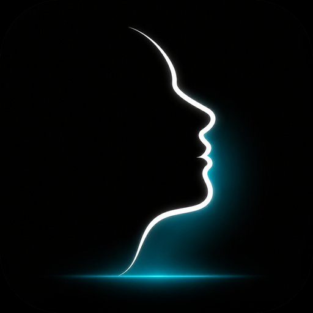
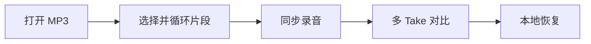
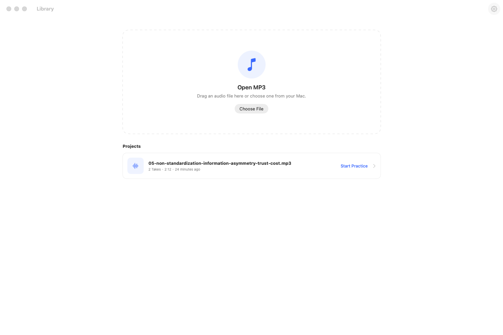
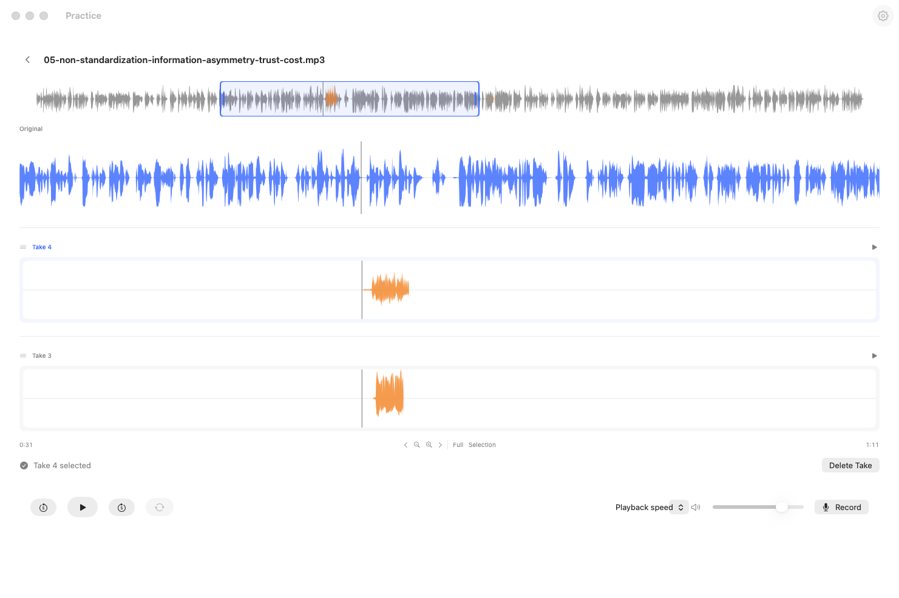
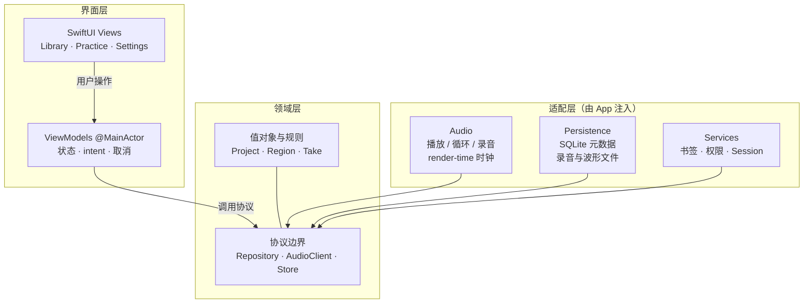

# Shadowing

<p align="center">
  
</p>

macOS 本地英语跟读练习应用。打开 MP3，选一段循环听，同步录音，在同一时间轴上对比原音与多条 Take。



数据默认只保存在本机：无账号、无上传、无网络依赖。

## 界面预览

### Library

拖入或选择 MP3，在统一的 Projects 列表里继续练习（含 Take 数量与最近活动时间）。右上角齿轮打开 Settings。

<p align="center">
  
</p>

### Practice

Original 与多条 Take 纵向对齐；选区循环、变速、录音与删除 Take 都在同一页完成。

<p align="center">
  
</p>

## 功能概览

- **Library**：拖入或选择 MP3；统一 Projects 列表（有录音时显示 Take 数量）
- **练习页**：完整波形 Overview、选区缩放 / 平移、循环播放、变速与音量
- **多轨跟读**：Original + 多条 Take 纵向对齐；Take 可独立播放与选区循环
- **覆盖重录**：选中 Take 后继续录音，按原音时间轴合并（空隙补静音）
- **Take 排序**：新 Take 默认在 Original 下方；可拖拽调整顺序
- **Settings**：窗口右上角齿轮打开浮窗（麦克风、倒计时、录音时是否播放原音等）

## 技术栈

| 层 | 选择 |
| --- | --- |
| UI | SwiftUI · Swift 6 · macOS 15+ |
| 音频 | AVFoundation / Core Audio |
| 元数据 | GRDB / SQLite |
| 录音与波形缓存 | 本地文件系统 |
| 工程 | XcodeGen（`Shadowing/project.yml` 为事实来源） |

MVP **不**引入 Rust、UniFFI、cargo-swift、网络服务或 AI 评分。持久化通过 Swift 协议注入，后续若评估 UniFFI，见 [ADR-0010](docs/adr/0010-rust-uniffi-adoption-threshold.md)。

## 架构

依赖方向见 [ADR-0003](docs/adr/0003-module-boundaries.md)：上层只依赖 Domain 协议，具体音频与存储实现由 App 组装后注入，不向 View / Domain 泄漏 AVFoundation 或 GRDB。



| 分层 | 做什么 | 不做什么 |
| --- | --- | --- |
| **Views** | 显示状态、发送 intent | 不碰 AVFoundation、GRDB、文件 I/O |
| **ViewModels** | 协调练习流程、异步任务与取消 | 不持有数据库具体类型 |
| **Domain** | 模型、不变量、状态规则与协议 | 不导入 SwiftUI / AVFoundation / GRDB |
| **Audio** | 选区循环、同步录音、波形采样；循环与录音边界用 sample/render time | 不在实时 callback 里访问数据库或阻塞主线程 |
| **Persistence** | Project / Take 元数据（SQLite）与录音文件；Take 提交顺序为临时写入 → 校验 → 原子移动 → 元数据事务 | 不向外泄漏 GRDB record 类型 |
| **Services** | security-scoped bookmark、麦克风权限、打开/恢复会话 | 不承载 UI 状态 |

`AppDependencies.live()` 是唯一组装点：把 `PracticeAudioEngine`、GRDB repository、`RecordingFileStore`、bookmark 等接到协议上，再交给 Features。更多决策见 [ADR 索引](docs/adr/README.md)。

## 环境要求

- macOS 15 或更高
- Xcode（含 macOS SDK）
- Homebrew

## 开发

```bash
make setup     # 安装工具、hooks，并生成 Xcode 工程
make build     # Debug 构建（无签名）
make upgrade   # 重新构建并启动 Debug app
make test      # 单元测试
make check     # format + lint + build + test
```

`make setup` 会按 `Brewfile` 安装依赖、安装 pre-commit hooks，并生成
`Shadowing/Shadowing.xcodeproj`。生成的工程不要提交，请改 `Shadowing/project.yml`。

运行 `make help` 可查看全部命令。本地与 CI 共用 `make check` 作为质量门禁。

## 源码结构

```text
Shadowing/
├── App/             入口与依赖组装
├── Domain/          模型、规则与持久化协议
├── Features/        功能 View / ViewModel
├── Audio/           播放、录音与波形
├── Persistence/     GRDB 与文件存储
├── Services/        权限、书签等平台能力
└── Tests/           单元 / 契约 / migration 测试
```

## 文档

- [MVP PRD](docs/prd/prd-v0.0.1-2026-07-11.md)
- [ADR 索引](docs/adr/README.md)
- [工程规范](CLAUDE.md)
- [P0 验收清单](docs/testing/p0-acceptance-checklist.md)
- [音频 Spike 报告](docs/testing/audio-spike-report.md)
- [界面参考图](assets/img/)
- [产品截图](docs/screenshots/)

## LICENSE

本项目采用 [Apache License 2.0](LICENSE)。
