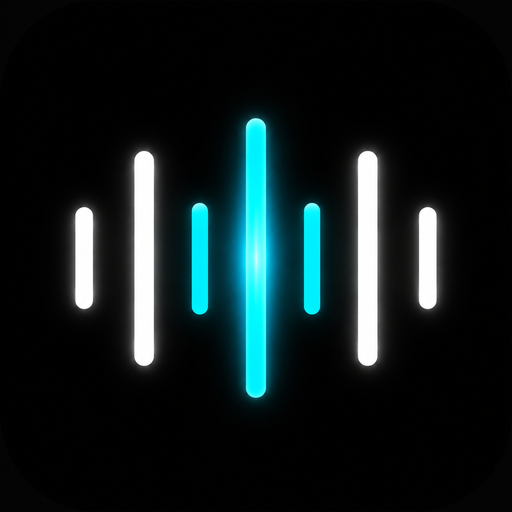
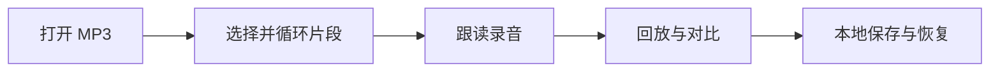
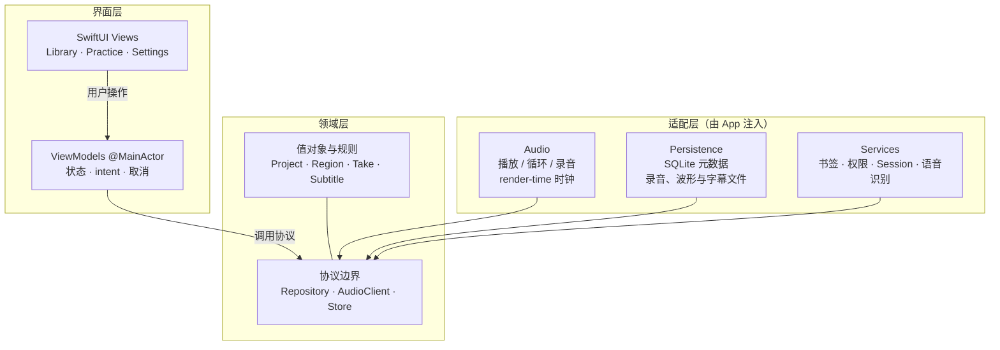

# Shadowing

<p align="center">
  
</p>

macOS 原生的英语跟读练习应用。打开一段 MP3，选一句或一段循环听，跟着录音，再把自己的每一遍和原音放在同一条时间轴上回放、对比。


```mermaid
flowchart LR
  A[打开 MP3] --> B[选择并循环片段]
  B --> C[跟读录音]
  C --> D[回放与对比]
  D --> E[本地保存与恢复]
```

数据只保存在本机：无账号、无上传。字幕识别也在本机完成，音频不会离开这台 Mac。

## 功能概览

- **练习材料**：左侧栏列出所有练习过的 MP3（显示跟读遍数与时长）；点击「打开 MP3…」或把 MP3 拖进窗口即可开始。再次打开时恢复上次的播放位置、选区、循环状态和波形缩放。
- **波形时间轴**：原音波形与当前录音上下对齐；支持触控板捏合缩放、缩放按钮、「全部」与「选段」快速切换视图，以及缩略总览条。
- **选区与循环**：在波形上拖动选出一段，拖动选区边缘可微调；点全文字幕里的句子可跳到这一句，按 Return 重播当前这一句。开启循环后只重复播放选区。
- **跟读录音**：每次录音都会新增一条录音（Take），不会覆盖以前的录音。可设置录音前倒计时，以及录音时是否同时播放原音。
- **录音列表**：每一遍都可以单独播放；可拖拽调整顺序，删除的录音会移到废纸篓。
- **对比播放**：三种方式：只听原音、只听我的、先原音再我的。
- **字幕**：波形下方的单行字幕和右侧的全文字幕都可以单独开关，默认都隐藏（先专心听）。可以附加 `.srt` / `.vtt` / `.lrc` 字幕，或附加 `.txt` 文稿；在 macOS 26 上还可以用本机语音识别生成字幕，并把文稿自动对齐到音频。字幕可以导出为 `.srt`。
- **变速**：0.5× – 1.5×，可在设置里指定默认速度。
- **外观与语言**：跟随系统的浅色 / 深色外观；界面支持简体中文和英文。

## 快捷键

快捷键（除 ⌘O 外都列在菜单栏「练习」(Practice) 中）：

| 操作 | 快捷键 |
| --- | --- |
| 播放 / 暂停 | Space |
| 录音 / 停止录音 | R |
| 对比播放 | C |
| 重播这一句 | Return |
| 后退 / 前进 5 秒 | ← / → |
| 循环开关 | L |
| 放慢 / 加快 | ⌘[ / ⌘] |
| 删除这一遍 | ⌘⌫ |
| 单行字幕 / 全文字幕 | ⌥⌘S / ⌥⌘I |
| 打开 MP3 | ⌘O |

## 安装

1. 从 [GitHub Releases](https://github.com/hedon954/shadowing/releases/latest) 下载 `Shadowing-<版本>.dmg`，把 Shadowing 拖进「应用程序」。
2. 安装包是 ad-hoc 签名、未经 Apple 公证的。第一次打开时 macOS 会拦截：在「应用程序」里右键点 Shadowing →「打开」；或者打开「系统设置 → 隐私与安全性」，在下方点「仍要打开」。之后就可以正常打开了。
3. 第一次录音时会请求麦克风权限。

系统要求：macOS 15 或更高。生成字幕和自动对齐文稿需要 macOS 26。

## 技术栈

| 层 | 选择 |
| --- | --- |
| UI | SwiftUI · Swift 6 · macOS 15+ |
| 音频 | AVFoundation / Core Audio |
| 字幕识别 | Speech（`SpeechAnalyzer`，macOS 26，本机运行） |
| 元数据 | GRDB / SQLite |
| 录音、波形与字幕缓存 | 本地文件系统 |
| 工程 | XcodeGen（`Shadowing/project.yml` 为事实来源） |

不引入 Rust、UniFFI、cargo-swift、网络服务或 AI 评分。持久化通过 Swift 协议注入，后续若评估 UniFFI，见 [ADR-0010](docs/adr/0010-rust-uniffi-adoption-threshold.md)。

## 架构

依赖方向见 [ADR-0003](docs/adr/0003-module-boundaries.md)：上层只依赖 Domain 协议，具体音频与存储实现由 App 组装后注入，不向 View / Domain 泄漏 AVFoundation 或 GRDB。


```mermaid
flowchart TB
  subgraph UI["界面层"]
    Views["SwiftUI Views<br/>Library · Practice · Settings"]
    VM["ViewModels @MainActor<br/>状态 · intent · 取消"]
  end

  subgraph Domain["领域层"]
    Models["值对象与规则<br/>Project · Region · Take · Subtitle"]
    Protocols["协议边界<br/>Repository · AudioClient · Store"]
  end

  subgraph Adapters["适配层（由 App 注入）"]
    Audio["Audio<br/>播放 / 循环 / 录音<br/>render-time 时钟"]
    Persist["Persistence<br/>SQLite 元数据<br/>录音、波形与字幕文件"]
    Services["Services<br/>书签 · 权限 · Session · 语音识别"]
  end

  Views -->|"用户操作"| VM
  VM -->|"调用协议"| Protocols
  Models --- Protocols
  Audio --> Protocols
  Persist --> Protocols
  Services --> Protocols
```

| 分层 | 做什么 | 不做什么 |
| --- | --- | --- |
| **Views** | 显示状态、发送 intent | 不碰 AVFoundation、GRDB、文件 I/O |
| **ViewModels** | 协调练习流程、异步任务与取消 | 不持有数据库具体类型 |
| **Domain** | 模型、不变量、状态规则与协议 | 不导入 SwiftUI / AVFoundation / GRDB |
| **Audio** | 选区循环、同步录音、波形采样；循环与录音边界用 sample/render time | 不在实时 callback 里访问数据库或阻塞主线程 |
| **Persistence** | Project / Take 元数据（SQLite）与录音文件；Take 提交顺序为临时写入 → 校验 → 原子移动 → 元数据事务 | 不向外泄漏 GRDB record 类型 |
| **Services** | 文件书签、麦克风权限、打开/恢复会话、本机语音识别 | 不承载 UI 状态 |

应用暂不启用 App Sandbox，书签不带安全作用域，见 [ADR-0011](docs/adr/0011-unsandboxed-app-and-plain-bookmarks.md)。`AppDependencies.live()` 是唯一组装点：把 `PracticeAudioEngine`、GRDB repository、`RecordingFileStore`、书签等接到协议上，再交给 Features。更多决策见 [ADR 索引](docs/adr/README.md)。

## 数据位置

正式版的数据在 `~/Library/Application Support/Shadowing`：`Shadowing.sqlite`（练习材料、录音列表与设置），以及 `Recordings/`、`Waveforms/`、`Subtitles/` 目录。原始 MP3 不会被复制，仍留在原来的位置。

## 从源码构建

环境要求：

- macOS 15 或更高
- Xcode 26 或更高（需要 macOS 26 SDK 才能编译语音识别部分）
- Homebrew

```bash
make setup     # 安装工具、hooks，并生成 Xcode 工程
make build     # Debug 构建（无签名）
make upgrade   # 重新构建并启动 Debug app
make test      # 单元测试
make check     # format + lint + build + test
make dmg       # Release DMG（ad-hoc 签名，build/Shadowing-<version>.dmg）
```

Debug 构建是独立的应用：bundle id 为 `com.hedon.shadowing.debug`，数据在
`~/Library/Application Support/Shadowing-Debug`。`make upgrade` 只重启 Debug 构建，不会动
装在 /Applications 的 Release 版（`com.hedon.shadowing`，数据在 `Application Support/Shadowing`）。

`make setup` 会按 `Brewfile` 安装依赖、安装 pre-commit hooks，并生成
`Shadowing/Shadowing.xcodeproj`。生成的工程不要提交，请改 `Shadowing/project.yml`。

运行 `make help` 可查看全部命令。本地与 CI 共用 `make check` 作为质量门禁。

## 源码结构

```text
Shadowing/
├── App/             入口、菜单与依赖组装
├── Domain/          模型、规则与持久化协议
├── Features/        功能 View / ViewModel（Files · Practice · Settings）
├── Audio/           播放、录音与波形
├── Persistence/     GRDB 与文件存储
├── Services/        权限、书签、语音识别等平台能力
└── Tests/           单元 / 契约 / migration 测试
```

## 文档

- [MVP PRD](docs/prd/prd-v0.0.1-2026-07-11.md)
- [ADR 索引](docs/adr/README.md)
- [CHANGELOG](CHANGELOG.md)
- [工程规范](CLAUDE.md)
- [P0 验收清单](docs/testing/p0-acceptance-checklist.md)
- [音频 Spike 报告](docs/testing/audio-spike-report.md)

## LICENSE

本项目采用 [Apache License 2.0](LICENSE)。
